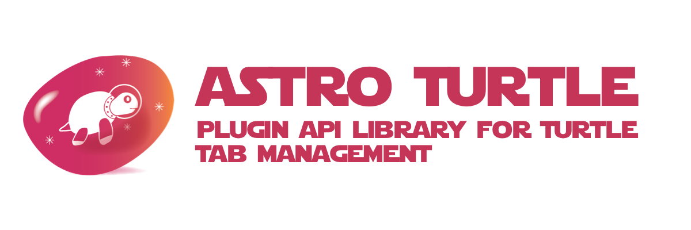

# astroturtle



> **THIS PROJECT IS STILL IN THE DESIGN PHASE**
>
> IDEAS & CONTRIBUTIONS ARE WELCOME
>
> An [Open Source Universe](https://github.com/intellibus/approach) Project

---

## Contents

- [astroturtle](#astroturtle)
  - [Contents](#contents)
  - [Features ✨](#features-)
  - [Install 🛠](#install-)
  - [Usage 🔭](#usage-)
  - [Documentation 🛰](#documentation-)
  - [Contributing 🌎](#contributing-)
  - [License ⚖️](#license-️)

## Features ✨

- Get Saved Tabs `Planned`
- Update Saved Tabs `Planned`
- Create New Saved Tabs `Planned`
- Modify Projects (Tab Groups) `Planned`
- Typescript Support `Planned`

## Install 🛠

```sh
npm install astroturtle
```

## Usage 🔭

Read more about the [Design](https://github.com/intellibus/astroturtle/blob/main/DESIGN.md) behind `astroturtle` here.

```typescript
import { searchTabs } from 'astroturtle';

const { data, error } = await searchTabs({
  query: {
    globalFilter: {
      filters: [{
        operator: 'LIKE',
        keyword: 'github'
      }]
    }
  }
}, TURTLE_API_KEY);

// { data: { tabs: [{...}] }, error: null }
```

## Documentation 🛰

`astroturtle` *is under active development, documentation will be added once an initial release is ready.*

## Contributing 🌎

We would love for you to contribute your ideas, code, & fixes to `astroturtle`.

We encourage everyone to read our [Design Document](https://github.com/intellibus/astroturtle/blob/main/DESIGN.md) to learn more about the thought process behind astroturtle.

Also check out the [rewards](https://github.com/intellibus/approach/blob/main/REWARDS.md) offered for contributing to the [Open Source Universe](https://github.com/intellibus/approach).

## License ⚖️

MIT
